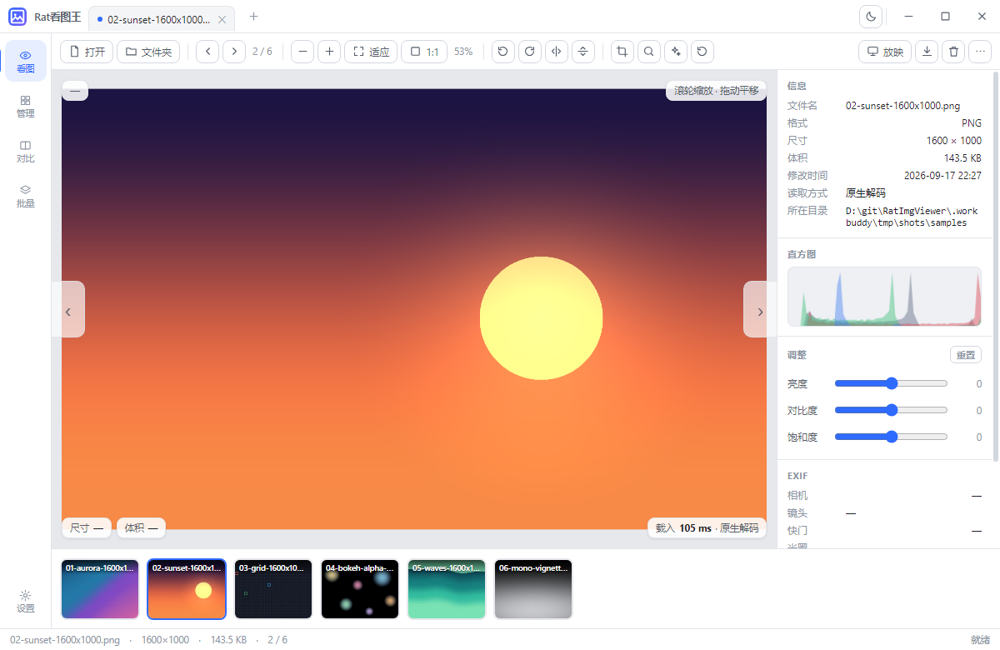
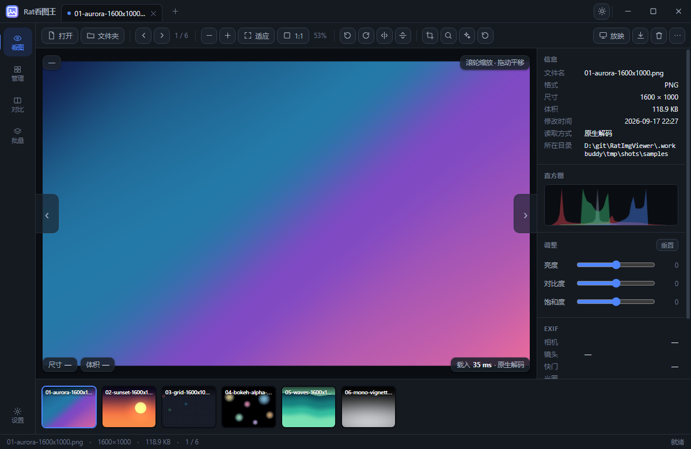
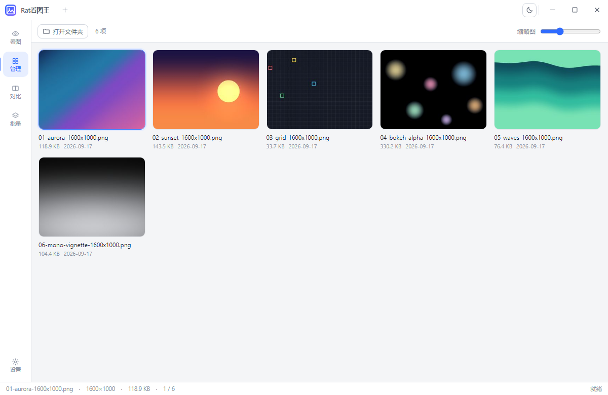
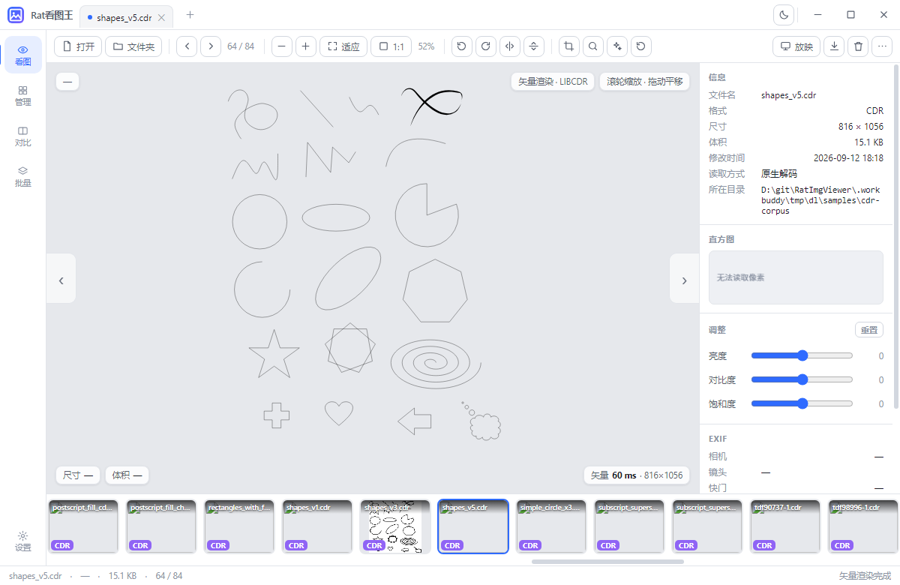
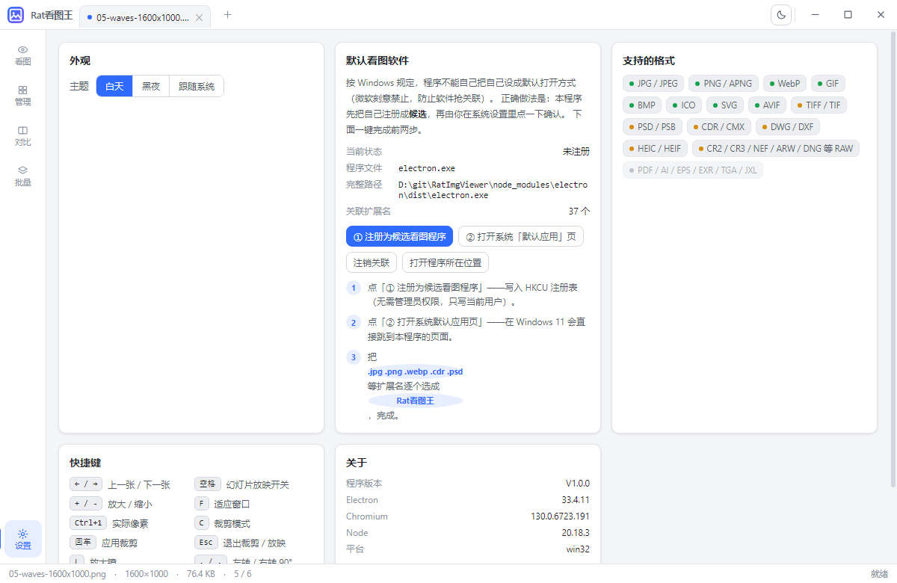

<div align="center">

# Rat 看图王

**轻量、快速的 Windows 看图工具 —— 顺手就能看 CDR、PSD、DWG/DXF 和相机 RAW**

[](https://github.com/mollyneko/RatImgViewer/releases/latest)
[](https://github.com/mollyneko/RatImgViewer/releases)
[](#下载与安装)
[](#许可)

[下载](#下载与安装) · [功能](#功能特性) · [格式](#支持格式) · [快捷键](#快捷键) · [截屏](#界面截图) · [从源码构建](#从源码构建)

</div>

---

## 这是什么

一个纯粹的看图工具。没有图层、没有滤镜曲线、不试图变成 Photoshop —— 它只做一件事：**把文件打开给你看，而且快**。

特别之处在于它能直接看一些同类看图软件打不开的东西：

- **CDR / CMX**（CorelDRAW）—— 内置 libcdr 矢量引擎，不装 CorelDRAW 也能看，无字体依赖、不糊
- **DWG / DXF**（CAD 图纸）—— 内置 LibreDWG，看图不用开 AutoCAD
- **PSD / PSB、TIFF、HEIC、相机 RAW** —— 直接抽取内嵌预览，秒开不等解析

## 下载与安装

前往 **[Releases 页面](https://github.com/mollyneko/RatImgViewer/releases/latest)** 下载最新版（Windows 10 / 11 64 位）：

| 文件 | 类型 | 适合谁 |
|---|---|---|
| **[RatImageViewer-Setup-V1.0.0.exe](https://github.com/mollyneko/RatImgViewer/releases/latest/download/RatImageViewer-Setup-V1.0.0.exe)** | 安装版（NSIS） | 日常使用。可选安装目录、创建桌面/开始菜单快捷方式、支持注册文件关联 |
| **[RatImageViewer-Portable-V1.0.0.exe](https://github.com/mollyneko/RatImgViewer/releases/latest/download/RatImageViewer-Portable-V1.0.0.exe)** | 免安装版（单文件） | 放 U 盘里随身带，双击即用，不写注册表、不留痕 |

> **关于「未知发布者」警告**
> 安装包未购买代码签名证书（EV 证书年费不便宜）。首次运行 Windows SmartScreen 会提示"已保护你的电脑"，
> 点「更多信息」→「仍要运行」即可。如果你介意，也可以直接[从源码构建](#从源码构建)。
>
> Releases 页面同时提供 `SHA256SUMS.txt`，可用 `certutil -hashfile <文件> SHA256` 核对完整性。

**系统要求**：Windows 10 1809 及以上 / Windows 11，x64。无需安装 .NET、运行库或任何解码包。

## 功能特性

### 看图

| | |
|---|---|
| **快速翻页** | 左右方向键 / 工具栏按钮 / 底部胶片条；缩略图走磁盘缓存，二次打开几乎瞬时 |
| **缩放** | 滚轮（以光标为锚点）缩放、适应窗口、1:1 实际像素、拖动平移 |
| **多标签** | 一个窗口开多个标签页，互不干扰 |
| **幻灯片** | 空格键开始/停止放映，定时自动翻页 |
| **放大镜** | 按 `L` 调出跟随放大镜，看清局部细节 |
| **信息面板** | 尺寸、体积、格式、解码耗时、EXIF（相机/镜头/光圈/快门/ISO）、RGB 直方图 |

### 格式支持与解码策略

分三层：**内置直解** → **抽取内嵌预览** → **矢量引擎渲染**。策略是"能秒开就秒开"，
绝不为了一张 PSD 去完整解析整个文件。

### 轻量调整（非破坏性）

- **旋转 / 翻转** —— 只写 EXIF Orientation 与 sidecar 记录，**原始像素一个字节都不动**
- **裁剪** —— 存的是矩形参数，随时可以还原；应用时才另存为新文件
- **亮度 / 对比度 / 饱和度 / 一键美化** —— 四项，没有再多了。实时预览，导出时才烘焙
- 想真正落盘？一律走「另存为」，原文件永远安全

### 管理、对比、批量

- **管理** —— 缩略图网格浏览整个文件夹，缩略图尺寸可调，磁盘缓存加速二次打开
- **对比** —— 左右并排 + 可拖动分割线，找差异（改图前后、两个版本）非常直观
- **批量** —— 批量转换格式（JPEG / PNG / WebP）、调质量、限制长边，逐行显示进度与状态

### 系统集成

- **文件关联** —— 一键注册为候选看图程序。注意：按微软的规定，程序**不能**把自己静默设成默认
  打开方式（UserChoice 注册表项有防篡改哈希）。所以正确姿势是：本程序注册候选 → 你在系统
  「默认应用」里点一下确认。
- **双击打开 / 拖拽打开** —— 支持把文件或整个文件夹拖进窗口
- **删除 = 回收站** —— 删除一律走 `shell.trashItem` 进系统回收站，绝不直接抹掉
- **完全离线** —— 不发任何网络请求，不看你的图，不收集数据。可以断网使用

## 界面截图

| 看图（白天） | 看图（黑夜） |
|---|---|
|  |  |

| 文件夹管理 | CDR 矢量渲染 |
|---|---|
|  |  |



> 截图取自真实程序运行画面。设计稿与架构文档见 [`design/`](design/) 目录。

## 支持格式

| 格式 | 处理方式 | 说明 |
|---|---|---|
| JPG / JPEG | 内置直解 | Chromium 解码 |
| PNG / APNG | 内置直解 | 支持透明与动画 |
| WebP | 内置直解 | 支持动画 |
| GIF | 内置直解 | 支持动画 |
| BMP / ICO | 内置直解 | — |
| AVIF | 内置直解 | — |
| SVG | 内置直解 | 矢量，可无损放大 |
| TIFF / TIF | 抽取内嵌预览 | 多页取首页 |
| PSD / PSB | 抽取内嵌预览 | 读 Photoshop 缩略图资源 |
| **CDR / CMX** | 预览 + libcdr 全量矢量 | 无内嵌预览时启动矢量引擎后台渲染并热替换 |
| **DWG / DXF** | LibreDWG 矢量解析 | 支持图层、文字、块参照；DXF 走纯 JS 解析，自动识别 gb18030 / Big5 编码 |
| HEIC / HEIF | 抽取内嵌预览 | — |
| CR2 / CR3 / NEF / ARW / DNG 等 RAW | 抽取内嵌 JPEG 预览 | 主流相机机型 |

暂不支持：PDF、AI、EPS、EXR、TGA、JXL（有需求可以提 issue）。

## 快捷键

| 按键 | 功能 | 按键 | 功能 |
|---|---|---|---|
| `←` / `→` | 上一张 / 下一张 | `C` | 进入裁剪模式 |
| `空格` | 幻灯片放映开关 | `回车` | 应用裁剪 |
| `+` / `-` | 放大 / 缩小 | `Esc` | 退出裁剪 / 放映 |
| `F` | 适应窗口 | `L` | 放大镜 |
| `Ctrl+1` | 实际像素 1:1 | `,` / `.` | 左转 / 右转 90° |
| `Ctrl+滚轮` | 缩放 | `H` / `V` | 水平 / 垂直翻转 |
| `Ctrl+O` | 打开图片 | `Del` | 删除到回收站 |
| `Ctrl+S` | 另存为 | `Ctrl+D` | 切换主题 |

## 从源码构建

```bash
# 前置：Node.js 18+（建议 20/22），Windows 环境
git clone https://github.com/mollyneko/RatImgViewer.git
cd RatImgViewer
npm install

npm start              # 开发模式直接运行
npm run smoke          # 冒烟测试（无头自检）
npm run dist           # 打包：NSIS 安装包 + 免安装版 → dist/
npm run dist:portable  # 只打免安装版
npm run dist:dir       # 只出未打包目录，调试用
```

### 仓库里的预编译二进制

`vendor/` 下是随包分发的预编译产物，**不进主包依赖链**，clone 下来即可直接用：

```
vendor/cdr2svg/         # CDR 矢量转换器（~44 MB）
                        #   cdr2svg.exe + libcdr / librevenge / ICU / lcms2 等运行库
                        #   由 libcdr 0.1.9 + librevenge 用 MSYS2 mingw-w64 编译成独立进程
vendor/libredwg-web/    # DWG/DXF 解析引擎（~10 MB）
                        #   @mlightcad/libredwg-web 0.7.10（LibreDWG 的 WASM 版）
```

设计上的两个关键取舍：

1. **CDR 用独立进程而不是 N-API 插件** —— 矢量解析器面对畸形文件崩溃是常态。
   独立进程可以做到崩溃隔离 + 30 秒超时 + 按「路径 + mtime + size + 页码」缓存结果，
   最坏情况也只是这一张图渲染失败，不会把整个看图软件带走。
2. **DWG 走 WASM 进程内** —— 图纸文件相对规整，进程内调用省掉 IPC 开销；
   `.dxf` 直接用纯 JS 文本解析器（零依赖），比 WASM 更快且能把编码问题处理干净。

### 项目结构

```
src/
  main/                    # 主进程
    main.js                #   应用入口、窗口、IPC、ratfile:// 自定义协议
    preload.js             #   contextBridge 安全桥
    scanner.js             #   目录扫描与预取
    exif.js                #   EXIF 解析
    preview.js             #   内嵌预览抽取（PSD/TIFF/HEIC/RAW/CDR）
    cache.js               #   磁盘缓存
    assoc.js               #   文件关联注册（HKCU）
    cdr.js                 #   CDR 转换进程调度
    dwg.js                 #   DWG/DXF 调度 + SVG 生成
    dwg-parser.js          #   DWG → 统一几何桶（WASM）
    dxf-parser.js          #   DXF → 统一几何桶（纯 JS）
  renderer/                # 渲染进程（原生 HTML/CSS/JS，无框架）
    index.html
    styles.css
    app.js
  design/                  # 交互设计稿与技术架构文档
  build/                   # 图标、NSIS 安装脚本
  tools/                   # 工具链校验、冒烟测试、发布脚本
```

**为什么渲染层不用 React/Vue**：这是个 5 屏的单窗口应用，DOM 结构基本静态，
状态也不复杂（当前文件 + 缩放 + 调整参数）。手写原生 JS 换来的是零构建步骤、
零框架体积、以及完全可控的重绘时机 —— 对"翻页要稳在 16 ms 内"这个目标很重要。

### 技术栈

Electron 33 · 原生 HTML/CSS/JS（渲染层无框架）· libcdr 0.1.9 + librevenge（CDR/CMX）
· LibreDWG via WebAssembly（DWG/DXF）· 位图走 `SharedArrayBuffer` 零拷贝交给渲染进程。

架构细节、性能目标与取舍记录见 [`design/architecture.html`](design/architecture.html)。

## 已知限制

- 只支持 Windows。渲染层是跨平台的，主要是文件关联、CDR 转换器、打包流程绑定了 Win32
- 安装包未签名，首次运行会有 SmartScreen 提示（见上）
- CDR/CMX 有内嵌预览的文件**保留预览图、不热替换成矢量**：libcdr 在某些文件上会把嵌入位图
  移出页面，且白字在浅色底上可见性更差，热替换反而是降级。只有无内嵌预览的 CDR 才走矢量渲染
- 相机 RAW 只读内嵌 JPEG 预览，不做完整 RAW 解码（正常看图足够，追求画质请用 Lightroom）
- CDR / DWG 这类矢量图看不到直方图：浏览器不允许把 SVG 图片画到 canvas 后读回像素（恶意 SVG 的
  信息泄露防护），所以矢量图的直方图区会显示"无法读取像素"。位图格式不受影响
- 暂不支持 PDF / AI / EPS

## 第三方组件与许可

本项目**自身代码**以 [MIT 许可](LICENSE) 发布。随包分发的第三方组件各有其许可：

| 组件 | 许可 | 用途 |
|---|---|---|
| [Electron](https://github.com/electron/electron) | MIT | 应用运行时 |
| [libcdr](https://git.libreoffice.org/libcdr) / [librevenge](https://sourceforge.net/projects/librevenge/) | MPL-2.0 | CDR / CMX 矢量解析 |
| [ICU](https://icu.unicode.org/) | Unicode License | 字符集与编码转换 |
| [lcms2](https://github.com/mm2/Little-CMS) | MIT | 色彩管理 |
| [zlib](https://zlib.net/) | zlib License | 压缩 |
| [@mlightcad/libredwg-web](https://github.com/mlightcad/libredwg-web) ／ [LibreDWG](https://www.gnu.org/software/libredwg/) | GPL-3.0 | DWG / DXF 解析 |

> ⚠️ **注意**：`libredwg-web` 及其底层 LibreDWG 是 **GPL-3.0**。也就是说，本项目的发布包
> 内同时包含 MIT 代码与 GPL-3.0 组件，属于混合分发。如果你打算基于本项目做二次分发或商用，
> 请先确认是否需要替换掉 DWG/DXF 模块，或者按 GPL-3.0 的要求处理。本项目作者不对使用者的
> 合规决策负责。

## 致谢

- [libcdr](https://git.libreoffice.org/libcdr) / [librevenge](https://sourceforge.net/projects/librevenge/) — CDR/CMX 的解析全靠它们
- [LibreDWG](https://www.gnu.org/software/libredwg/) 与 [@mlightcad/libredwg-web](https://github.com/mlightcad/libredwg-web) — DWG/DXF 引擎
- [Electron](https://github.com/electron/electron) 团队

## 许可

[MIT](LICENSE) © 2026 Rat (mollyneko)
